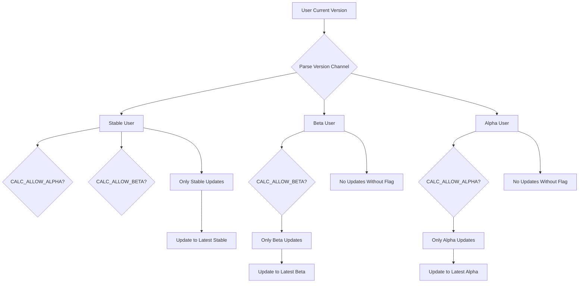
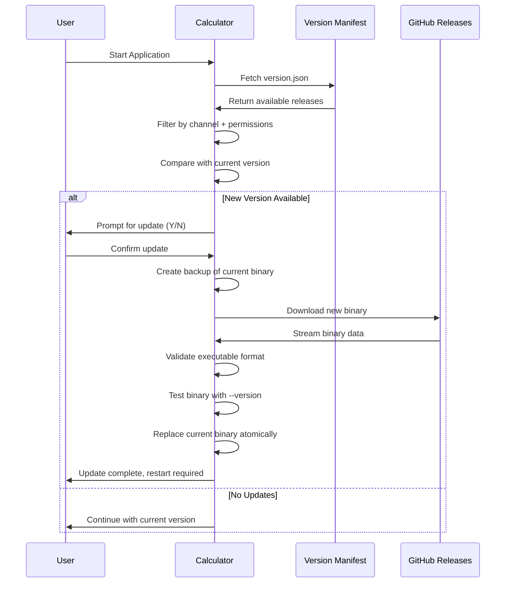

# Golang Calculator

An interactive CLI calculatur that makes 1999 jealous with a release, update and distribution model from the modern century with enterprise-grade CI/CD pipelines and sophisticated auto-update system. This is a demonstration of production-ready software engineering practices including semantic versioning, channel-based release management, testing, and automated deployment workflows.

## Table of Contents

- [Quick Start](#quick-start)
- [Installation](#installation)
  - [Linux Installation](#linux-installation)
  - [macOS Installation](#macos-installation)
  - [Windows Installation](#windows-installation)
- [Development Workflow](#development-workflow)
  - [Common Build Operations](#common-build-operations)
  - [Code Quality Standards](#code-quality-standards)
  - [Pre-commit Hooks](#pre-commit-hooks)
- [Release Channel System](#release-channel-system)
  - [Channel Types](#channel-types)
  - [Environment Variables](#environment-variables)
  - [Channel Isolation Logic](#channel-isolation-logic)
- [Understanding Channel Isolation (Important!)](#understanding-channel-isolation-important)
  - [Why You Need Environment Variables](#why-you-need-environment-variables)
  - [Channel Switching Limitations](#channel-switching-limitations)
  - [Common Channel Scenarios](#common-channel-scenarios)
  - [Why This Design?](#why-this-design)
- [Auto-Update Architecture](#auto-update-architecture)
  - [Update Flow Diagram](#update-flow-diagram)
  - [Version Comparison Logic](#version-comparison-logic)
  - [Security & Validation](#security--validation)
- [CI/CD Pipeline](#cicd-pipeline)
  - [GitHub Actions Workflows](#github-actions-workflows)
  - [Release Process](#release-process)
  - [Version Manifest Management](#version-manifest-management)
- [Code Architecture](#code-architecture)
  - [Directory Structure](#directory-structure)
  - [Package Dependencies](#package-dependencies)
  - [Core Components](#core-components)
- [Testing Strategy](#testing-strategy)
- [Troubleshooting](#troubleshooting)
- [Contributing](#contributing)

## Quick Start

Get the calculator running in under 60 seconds:

```bash
# Clone the repository
git clone https://github.com/jondkelley/cicd_golang_calculator.git
cd cicd_golang_calculator

# Build and run alpha version
export VERSION=0.0.1-alpha
make build
./calc

# Build and run beta version
export VERSION=0.0.1-beta
make build
/calc

# Build and run stable
export VERSION=0.0.1
make build
./calc

# Example usage
> 2 + 3
= 5
> sqrt(16)
= 4
> 10 / 3
= 3.333333
```

The calculator supports these operations: addition (+), subtraction (-), multiplication (*), division (/), modulus (%), exponentiation (^), and square root (sqrt()).

## Installation

### Linux Installation

Download the latest release and make it executable:

```bash
# Download the latest stable release
curl -L https://github.com/jondkelley/cicd_golang_calculator/releases/latest/download/calc-linux-amd64 -o calc

# Make executable
chmod 755 calc

# Optional: Move to system PATH
sudo mv calc /usr/local/bin/
```

### macOS Installation

macOS requires additional steps due to code signing restrictions:

```bash
# Download the appropriate binary for your Mac
# For Intel Macs:
curl -L https://github.com/jondkelley/cicd_golang_calculator/releases/latest/download/calc-darwin-amd64 -o calc

# For Apple Silicon Macs:
curl -L https://github.com/jondkelley/cicd_golang_calculator/releases/latest/download/calc-darwin-arm64 -o calc

# Make executable
chmod 755 calc

# Remove quarantine attribute (required for unsigned binaries)
xattr -d com.apple.quarantine calc

# Optional: Move to system PATH
sudo mv calc /usr/local/bin/
```

**Note:** The quarantine removal step is necessary because we don't currently have an Apple Developer Certificate. Future releases will include proper code signing to eliminate this requirement.

### Windows Installation

```bash
# Download the Windows executable
curl -L https://github.com/jondkelley/cicd_golang_calculator/releases/latest/download/calc-windows-amd64.exe -o calc.exe

# Run directly
calc.exe
```

Windows Defender might flag the executable as potentially unsafe. This happens with unsigned binaries. Click "More info" then "Run anyway" if prompted.

## Development Workflow

### Common Build Operations

The project uses a comprehensive Makefile for all build operations. Here are the essential commands:

```bash
# Build for current platform
make build

# Run comprehensive tests
make test

# Format all Go code
make fmt

# Run static analysis
make vet

# Build for all platforms
make build-all

# Complete CI pipeline locally
make ci
```

For detailed information about all available targets, see [Makefile.md](Makefile.md) which contains comprehensive documentation of the build options.

### Code Quality Standards

This project maintains production-grade code quality through automated checks:

- **Go Format**: All code must pass `gofmt` formatting
- **Go Lint**: Zero linting violations allowed via `golint`
- **Go Vet**: Static analysis must pass without warnings
- **Test Coverage**: Comprehensive unit tests required for all logic

### Pre-commit Hooks

Set up pre-commit hooks to catch issues before pushing:

```bash
# Create pre-commit hook
cat > .git/hooks/pre-commit << 'EOF'
#!/bin/sh
echo "Running pre-commit checks..."

# Format check
if ! make fmt; then
    echo "XXX Code formatting failed"
    exit 1
fi

# Vet check
if ! make vet; then
    echo "XXX Go vet failed"
    exit 1
fi

# Run tests
if ! make test; then
    echo "XXX Tests failed"
    exit 1
fi

echo "[OK] All pre-commit checks passed"
EOF

# Make executable
chmod +x .git/hooks/pre-commit
```

**Pull Request Requirements**: All PRs must pass format checks, linting, and the complete test suite before merging. The CI pipeline enforces these requirements automatically.

## Release Channel System

The calculator implements a sophisticated three-tier release channel system providing users with different stability guarantees.

### Channel Types

| Channel | Stability | Use Case |
|---------|-----------|----------|
| **Stable** | Production-ready | End users, production environments |
| **Beta** | Feature-complete, testing phase | Early adopters, staging environments |
| **Alpha** | Bleeding edge, experimental | Developers, testing new features |

### Environment Variables

Control your update channel using environment variables:

```bash
# Stay on stable channel (default behavior)
./calc

# Enable alpha releases
CALC_ALLOW_ALPHA=1 ./calc

# Enable beta releases  
CALC_ALLOW_BETA=1 ./calc
```

### Channel Isolation Logic

The system enforces strict channel isolation to prevent unexpected version changes:



## Understanding Channel Isolation (Important!)

**🚨 CRITICAL CONCEPT**: The calculator uses strict channel isolation to prevent unexpected upgrades and downgrades. This means **you cannot switch between channels through updates** - you can only update within your current channel.

### Why You Need Environment Variables

The environment variables (`CALC_ALLOW_ALPHA` and `CALC_ALLOW_BETA`) are **required** for pre-release users to receive updates. This is a safety feature to prevent accidental upgrades to unstable versions.

#### Scenario Examples:

**✅ Alpha User Getting Alpha Updates:**
```bash
# Current version: v0.0.1-alpha
# Available: v0.0.2-alpha
CALC_ALLOW_ALPHA=1 ./calc
# Result: "new version v0.0.2-alpha (ALPHA RELEASE) available"
```

**❌ Alpha User Trying to Get Beta Updates:**
```bash
# Current version: v0.0.2-alpha  
# Available: v0.0.100-beta
CALC_ALLOW_BETA=1 ./calc
# Result: "everything is up to date!" (beta updates blocked)
```

**✅ Beta User Getting Beta Updates:**
```bash
# Current version: v0.0.1-beta
# Available: v0.0.100-beta
CALC_ALLOW_BETA=1 ./calc
# Result: "new version v0.0.100-beta (BETA RELEASE) available"
```

**❌ Beta User Without Environment Variable:**
```bash
# Current version: v0.0.1-beta
# Available: v0.0.100-beta
./calc  # No CALC_ALLOW_BETA=1
# Result: "everything is up to date!" (no updates without flag)
```

### Channel Switching Limitations

**You CANNOT switch channels through the auto-updater.** The system enforces these rules:

| Current Channel | Can Update To | Cannot Update To |
|----------------|---------------|------------------|
| **Alpha** (`v1.0.0-alpha`) | ✅ Newer alpha only | ❌ Beta, Stable |
| **Beta** (`v1.0.0-beta`) | ✅ Newer beta only | ❌ Alpha, Stable |
| **Stable** (`v1.0.0`) | ✅ Newer stable only | ❌ Alpha, Beta |

### Common Channel Scenarios

**Scenario 1: "I'm on alpha but want to try beta"**
```bash
# ❌ This will NOT work:
CALC_ALLOW_BETA=1 ./calc  # Still shows "up to date"

# ✅ Manual channel switch required:
wget https://github.com/jondkelley/cicd_golang_calculator/releases/download/v0.0.100-beta/calc-linux-amd64
chmod +x calc-linux-amd64 && mv calc-linux-amd64 calc
```

**Scenario 2: "I'm on beta but want the latest stable"**
```bash
# ❌ This will NOT work:
./calc  # Still shows "up to date" (can't cross to stable)

# ✅ Manual installation required:
wget https://github.com/jondkelley/cicd_golang_calculator/releases/latest/download/calc-linux-amd64
chmod +x calc-linux-amd64 && mv calc-linux-amd64 calc
```

**Scenario 3: "I forgot to set the environment variable"**
```bash
# Current: v0.0.1-alpha, Available: v0.0.2-alpha
./calc  # Shows "everything is up to date!" ❌

# Fix: Add the environment variable
CALC_ALLOW_ALPHA=1 ./calc  # Shows update available ✅
```

### Why This Design?

This strict channel isolation prevents:
- **Accidental downgrades** (e.g., stable → beta)
- **Unexpected instability** (e.g., auto-upgrade from stable to alpha)
- **Version confusion** (mixing different pre-release types)
- **Dependency conflicts** (different channels may have different requirements)

**Bottom Line**: If you want to switch channels, you must manually download and install a release from your desired channel. The auto-updater only works within your current channel for safety.

## Auto-Update Architecture

### Update Flow Diagram



### Version Comparison Logic

The semantic version parser handles complex comparison scenarios:

```go
// Example version comparisons
v1.2.3 > v1.2.2        // Patch increment
v1.3.0 > v1.2.9        // Minor increment
v2.0.0 > v1.9.9        // Major increment
v1.0.0 > v1.0.0-beta   // Stable > pre-release
v1.0.0-beta > v1.0.0-alpha  // Beta > alpha
```

**Critical Edge Case Handling:**
- Pre-release versions stay within their channel
- Invalid version strings get skipped gracefully
- Network failures don't crash the application
- Malformed manifest data triggers warnings but allows continued operation

### Security & Validation

The update system implements multiple validation layers:

1. HTTP Response Validation: Status codes, content types, response sizes
2. Executable Format Validation: Magic byte verification (ELF, Mach-O, PE)
3. Functional Testing: Execute `--version` on downloaded binary
4. Atomic Replacement: Temp file validation before overwriting current binary
5. Backup Creation: Automatic backup before any update attempt

**Future Security Enhancements**: The architecture supports cryptographic signature verification. Future releases can include SHA-256 checksums and GPG signatures for enhanced security.

## CI/CD Pipeline

### GitHub Actions Workflows

The project uses two primary workflows for comprehensive automation:

#### Release Workflow (`release.yml`)
Triggers on git tag pushes and handles:
- Multi-platform binary compilation (Linux, Windows, macOS Intel/ARM)
- GitHub release creation with binary attachments
- Version extraction from git tags
- Build artifact verification

#### Quality Checks Workflow (`checks.yml`)
Runs on every push and PR:
- Go formatting verification
- Linting with golint
- Complete test suite execution
- Prevents merge of non-compliant code

### Release Process

Create releases using git tags with semantic versioning:

```bash
# Stable release
git tag v1.2.3
git push origin v1.2.3
(or just make tag TAG=v1.2.3)

# Beta release
git tag v1.3.0-beta
git push origin v1.3.0-beta
(or just make tag TAG=v1.3.0-beta)

# Alpha release  
git tag v1.4.0-alpha
git push origin v1.4.0-alpha
(or just make tag TAG=v1.4.0-alpha)
```

The CI pipeline automatically:
1. Builds binaries for all platforms
2. Creates GitHub release with assets
3. Updates the global version manifest
4. Handles concurrent release conflicts with exponential backoff

### Version Manifest Management

The `version.json` file serves as the central registry for all releases:

```json
{
  "releases": [
    {
      "version": "v1.0.1",
      "urls": {
        "linux": "https://github.com/.../calc-linux-amd64",
        "windows": "https://github.com/.../calc-windows-amd64.exe",
        "darwin": "https://github.com/.../calc-darwin-amd64",
        "darwin-arm64": "https://github.com/.../calc-darwin-arm64"
      },
      "isAlpha": false,
      "isBeta": false,
      "releaseDate": "2025-06-01T03:53:44Z"
    }
  ]
}
```

**Conflict Resolution**: The system rebuilds the entire manifest from GitHub API data using Python scripts with retry logic. This prevents race conditions during concurrent releases.

## Code Architecture

### Directory Structure

```
├── cmd/calculator/          # Main application entry point
│   ├── main.go             # CLI interface and expression parsing
│   └── main_test.go        # Integration tests
├── internal/calculator/     # Core calculation engine
│   ├── calculator.go       # Mathematical operations
│   └── calculator_test.go  # Comprehensive unit tests
├── internal/updater/        # Auto-update system
│   ├── types.go            # Data structures
│   ├── manifest.go         # Version manifest handling
│   ├── download.go         # Binary download logic
│   ├── validation.go       # Security validation
│   ├── utils.go           # File operations
│   └── updater.go         # Update orchestration
├── .github/workflows/      # CI/CD automation
└── Makefile               # Build automation
```

### Package Dependencies

The project maintains minimal external dependencies:
- **Standard Library Only**: Core functionality uses only Go standard library
- **GitHub API**: Release manifest fetching via HTTP client
- **Cross-Platform Support**: Runtime detection for platform-specific downloads

### Core Components

**Calculator Engine** (`internal/calculator`):
- Comprehensive error handling for edge cases
- Floating-point precision management
- Support for basic and advanced operations

**Update System** (`internal/updater`):
- Semantic version parsing and comparison
- Channel-based release filtering
- Binary download and validation

**CLI Interface** (`cmd/calculator`):
- Interactive REPL with signal handling
- Expression parsing with regex validation
- Version information display
- Update check integration

## Testing Strategy

The project implements comprehensive testing across multiple layers:

**Unit Tests**
- Mathematical operation validation
- Edge case handling (division by zero, negative square roots)
- Floating-point precision verification
- Channel isolation verification
- Version comparison logic

**Integration Tests**:
- Expression parsing with real calculator instances
- Update flow simulation with mock HTTP responses
- Cross-platform binary validation

Run the complete test suite:
```bash
# Run all tests with verbose output
make test

# Run tests with coverage analysis
make test-coverage

# Run benchmarks
make bench
```

## Troubleshooting

### Common Issues

**Update Check Failures**:
```bash
# Check network connectivity
curl -I https://raw.githubusercontent.com/jondkelley/cicd_golang_calculator/main/version.json

# Verify environment variables
echo $CALC_ALLOW_ALPHA
echo $CALC_ALLOW_BETA
```

**macOS Security Warnings**:
```bash
# Remove quarantine after download
xattr -d com.apple.quarantine calc-darwin-amd64

# Verify removal
xattr -l calc-darwin-amd64
```

**Build Issues**:
```bash
# Clean and rebuild
make clean
make deps
make build

# Check Go version
go version  # Requires Go 1.21+
```

## Contributing

Follow these guidelines:

1. **Fork and Clone**: Create your own fork of the repository
2. **Branch Strategy**: Create feature branches from `main`
3. **Code Quality**: Ensure all pre-commit checks pass
4. **Testing**: Add tests for new functionality
5. **Documentation**: Update relevant documentation

**Development Setup**:
```bash
git clone https://github.com/your-fork/cicd_golang_calculator.git
cd cicd_golang_calculator
make deps
make ci  # Verify everything works
```